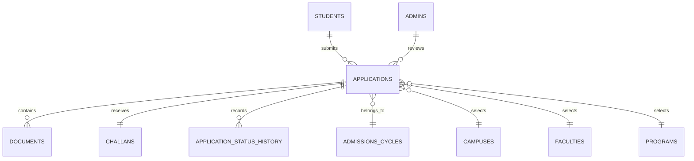

# Ahmer Institute of Technology Admissions Portal

A secure PHP/MySQL admissions portal for students, admissions reviewers, sub-admins, and super administrators.

## Features

### Student experience

- Public AIT home page and account registration
- Student login with animated password visibility and submit feedback
- Apply Online form for identity, contact, academic, program, and quota information
- Required and optional document uploads with one-file-per-field enforcement
- Draft preservation for text fields and accidental refresh/close protection
- Application status timeline and review notes
- Approval-gated branded fee challan
- Bank, university, and candidate challan copies
- Paid challan receipt upload
- Test slip access only after approved application status

### Administration

- Admin and super-admin authentication
- Super-admin secret-key gate from `.env`
- Secure admin password recovery
- Application review with approve/reject actions and notes
- Race-safe approval transactions and idempotent action handling
- Sub-admin creation, expiry, profile updates, transfer, and termination
- Glassmorphism dashboard with responsive sidebar and mobile navigation
- Confirmation before sign-out and protection against losing edited modal forms

## Technology

- PHP 8.x
- MySQL 8.x or MariaDB
- Apache/XAMPP
- HTML5, CSS3, JavaScript
- Bootstrap 5 and Bootstrap Icons
- MySQLi for the established application workflow
- PDO with native prepared statements for admin authentication and recovery
- GD, Fileinfo, and OpenSSL PHP extensions

## Architecture

```text
Public pages
  pages/home.php, pages/about.php, pages/admissions.php, ...
  log-in.php, registration.php
        |
Student portal
  dashboard.php
        |
Workflow endpoints
  submit_application.php
  upload_challan.php
  generate_challan.php
  generate_slip.php
        |
Admin portal
  admin/login.php
  admin/forgot-password.php
  admin/dashboard.php
        |
Shared services
  backend/security.php
  backend/data.php
  backend/pdo.php
  backend/env.php
        |
Database
  database/schema.sql
```

### Public delivery conventions

- Public pages have clean URLs such as `/AIT/about`, `/AIT/programs`, and `/AIT/admissions`; direct `.php` requests are canonicalized by `.htaccess`.
- Shared public rendering, database-backed content, CSP bootstrap, and navigation live in `backend/site.php`.
- Public visual tokens and responsive layouts live in `assets/css/public.css`; `assets/js/theme.js` persists the light/dark preference as `ait-theme` across public and portal pages.
- GitHub Actions validates PHP syntax, tracked-file whitespace, and the public rewrite map on every push and pull request through `.github/workflows/ci.yml`.
- Public presentation entry points live under `pages/`; root PHP files are reserved for authentication and admissions workflow endpoints, while `.htaccess` serves nested public pages through clean URLs.

### Database relationships



## Important files

| Path                        | Responsibility                                                      |
| --------------------------- | ------------------------------------------------------------------- |
| `dashboard.php`             | Authenticated student dashboard and Apply Online form               |
| `submit_application.php`    | Validates and stores applications/documents/challan transactionally |
| `upload_challan.php`        | Stores paid challan receipt and preserves approved status           |
| `generate_challan.php`      | Renders the branded fee voucher                                     |
| `admin/login.php`           | Admin authentication and super-admin key verification               |
| `admin/forgot-password.php` | Protected super-admin password recovery                             |
| `admin/dashboard.php`       | Application review and admin operations                             |
| `backend/security.php`      | CSRF, CSP, rate limiting, and upload validation                     |
| `backend/pdo.php`           | Strict PDO connection for authentication operations                 |
| `database/schema.sql`       | Schema, constraints, indexes, and reporting views                   |

## Security model

- CSRF token required on state-changing forms.
- CSP nonce generated per response for inline scripts/styles.
- Prepared statements with MySQLi or native PDO prepares.
- Admin sessions regenerate after successful login.
- Admin records must be active and within their expiry window.
- Super-admin login and recovery require `SUPERADMIN_SECRET_KEY`.
- Login, recovery, uploads, and admin actions are rate limited.
- Approval uses `FOR UPDATE` row locks and transactions.
- Challans are unique per application and action requests are idempotency guarded.
- Uploaded images are MIME inspected, dimension checked, and re-encoded to WebP.
- PDFs must have an application/pdf MIME type and `%PDF-` signature.
- Upload directories block PHP and other executable extensions.
- Production deployments should add antivirus scanning such as ClamAV for uploaded documents.

## Screenshots and demo assets

Sample dashboard and document visuals are stored in `assets/images/dashboard_sample/` and `assets/images/ait_sample_doc/`. The application is demonstrated by running the local setup and walking through registration, application submission, super-admin approval, challan generation, and receipt upload.

## Production deployment

- Use a virtual host or deployment-specific base path instead of relying on `/AIT/` rewrite assumptions.
- Terminate TLS at Apache or the reverse proxy and redirect HTTP to HTTPS in the production virtual host.
- Use a least-privilege database account and rotate `SUPERADMIN_SECRET_KEY`.
- Keep `.env`, uploads, database backups, and logs outside public download paths.
- Configure PHP with `display_errors=0`, secure cookie defaults, and centralized error logging.
- Add antivirus scanning before uploaded files are made available to staff.

See [SECURITY.md](SECURITY.md) for reporting and operational guidance.

## Setup

1. Install PHP 8.x with `mysqli`, `pdo_mysql`, `fileinfo`, `gd`, and `openssl`.
2. Start Apache and MySQL.
3. Import `database/schema.sql` into MySQL.
4. Copy `.env.example` to `.env` and set database credentials and a strong secret key.
5. Ensure `uploads/` is writable by the web server and not executable.
6. Open the project through Apache, for example `http://localhost/AIT/`.

Example configuration:

```env
DB_HOST=localhost
DB_USER=ait_user
DB_PASS=replace-with-a-strong-password
DB_NAME=ait
SUPERADMIN_SECRET_KEY=replace-with-a-long-random-secret
```

Never commit `.env`, database dumps, uploaded documents, or generated credentials.

## Admin access

Admin login is at `admin/login.php`. Super-admin accounts require both their account password and the configured `.env` secret key. Password recovery is at `admin/forgot-password.php` and requires the same secret key.

The schema seeds the support super-admin account only when the database import is run. Rotate that password immediately in a real deployment.

## Development checks

Run syntax checks on changed PHP files:

```powershell
php -l admin/login.php
php -l admin/forgot-password.php
php -l admin/dashboard.php
php -l dashboard.php
php -l submit_application.php
php -l upload_challan.php
php -l generate_challan.php
git diff --check
```

## Documentation

- [SECURITY.md](SECURITY.md): security controls and vulnerability reporting
- [llms.txt](llms.txt): concise machine-readable project context
- [llms-full.txt](llms-full.txt): detailed architecture and change constraints
- [LICENSE.txt](LICENSE.txt): project usage terms
